# 📋 VAHAN Dashboard — Complete Work Report

**Project**: VAHAN RTO Vehicle Registration Analytics Dashboard  
**File**: [app.py](file:///C:/Users/abhir/.gemini/antigravity/scratch/vahan_analytics/app.py) (1,806 lines)  
**Dataset**: [VAHAN_Dataset_Fully_Corrected_Issues.csv](file:///C:/Users/abhir/.gemini/antigravity/scratch/vahan_analytics/VAHAN_Dataset_Fully_Corrected_Issues.csv) (3,700 records · 18 columns · 13 states · 2018–2024)  
**Tech Stack**: Python 3 · Streamlit 1.57.0 · Altair 6.0 · Pandas · NumPy  
**Date**: 2026-08-08  
**Live URL**: http://localhost:8501

---

## Table of Contents

1. [Phase 1: Runtime Crash Fixes](#phase-1-runtime-crash-fixes)
2. [Phase 2: Visual Contrast & CSS Fixes](#phase-2-visual-contrast--css-fixes)
3. [Phase 3: Comprehensive Code Audit](#phase-3-comprehensive-code-audit)
4. [Phase 4: Senior Data Analyst Audit](#phase-4-senior-data-analyst-audit)
5. [Phase 5: Critical Data Logic Fixes](#phase-5-critical-data-logic-fixes)
6. [Phase 6: Visualization Expert Upgrades](#phase-6-visualization-expert-upgrades)
7. [Phase 7: Final Color & Polish Pass](#phase-7-final-color--polish-pass)
8. [Full Change Log](#full-change-log)
9. [Final Architecture](#final-architecture)

---

## Phase 1: Runtime Crash Fixes

The dashboard was crashing on startup with multiple errors.

### Fix 1.1: `numexpr` / NumPy 2.x Compatibility
```diff
- import numexpr  # Crash: incompatible with NumPy 2.x
+ import sys
+ sys.modules['numexpr'] = None  # Prevent crash
```
**Problem**: `numexpr` module was incompatible with the installed NumPy 2.x, causing an immediate import crash.  
**Solution**: Injected a module bypass at the top of `app.py` to suppress the import.

### Fix 1.2: Altair 6.0 Theme Registration API
```diff
- alt.theme.register("brief", base_theme, enable=True)  # TypeError in Altair 6.0
+ @alt.theme.register("brief", enable=True)
+ def brief_theme():
+     return base_theme()
```
**Problem**: Altair 6.0 changed `alt.theme.register` from a function-call API to a **decorator-only API**. The old 3-argument call threw `TypeError: register() takes 1 positional argument but 2 were given`.  
**Solution**: Wrapped `base_theme()` with the decorator pattern, with a `try/except` fallback for older Altair versions.

---

## Phase 2: Visual Contrast & CSS Fixes

The dashboard had severe readability issues in Light Mode — text, sidebar, inputs, and metrics were invisible or poorly contrasted.

### Fix 2.1: Theme Variable System
Added complete dual-mode theme constants:

| Variable | Dark Mode | Light Mode | Purpose |
|----------|-----------|------------|---------|
| `SIDEBAR_BG` | `#0B0F17` | `#FFFFFF` | Sidebar background |
| `INPUT_BG` | `#151D2A` | `#FFFFFF` | Input field backgrounds |
| `TAG_BG` | `#0B2545` | `#E0F2FE` | Multiselect tag backgrounds |
| `TAG_TEXT` | `#38BDF8` | `#0284C7` | Multiselect tag text |
| `BAR_SECONDARY` | `#334155` | `#CBD5E1` | Non-highlighted bar fill |
| `HM_TEXT_LIGHT` | `#F8FAFC` | `#FFFFFF` | Heatmap text on dark cells |
| `HM_TEXT_DARK` | `#F8FAFC` | `#0F172A` | Heatmap text on light cells |

### Fix 2.2: Comprehensive CSS Injection (Lines 104–530)
Added **15 new CSS rule blocks** for previously unstyled Streamlit widgets:

| Widget | Issue | CSS Fix |
|--------|-------|---------|
| `st.metric` labels | Scoped only to sidebar — main content metrics unstyled | Made **global** selectors |
| `st.metric` values | Not bold enough in Light mode | Added `font-weight: 800` |
| `st.metric` deltas | Invisible in Dark mode | Explicit `color: {TEXT_MUTED}` |
| `st.caption` | Invisible in both modes | Explicit `color: {TEXT_MUTED}` |
| `st.dataframe` | Default white borders in Dark mode | Custom `border: 1px solid {CARD_BORDER}` |
| `st.download_button` | Unstyled in both modes | Custom bg/border/hover styles |
| `st.date_input` | White bg on dark sidebar | `background-color: {INPUT_BG}` |
| `st.slider` thumb | Default blue, no theme match | `background-color: {ACCENT}` |
| `st.slider` track | Default grey, invisible | `background: {GREY_LIGHT}` |
| `st.info/success/warning` | Text invisible in Dark mode | `color: {INK_MAIN}` |
| `st.notification` | Text invisible | `color: {INK_MAIN}` |
| `hr` dividers | Too bright in Dark mode | `border-color: {CARD_BORDER}` |
| DataFrames progress bars | Default color | `background-color: {ACCENT}` |
| Vega tooltips | White bg in Dark mode | Full theme-aware tooltip styling |
| Selectbox/multiselect | Text invisible in sidebar | `color: {INK_MAIN}`, `background: {INPUT_BG}` |

---

## Phase 3: Comprehensive Code Audit

Ran a full-code audit using a specialized subagent that analyzed all 1,700+ lines.

### Fix 3.1: `str.extract` Returns DataFrame (Line 872)
```diff
- df["RTO_Code"] = df["RTO_Office"].astype(str).str.extract(r"\(([A-Z]{2})-")
+ df["RTO_Code"] = df["RTO_Office"].astype(str).str.extract(r"\(([A-Z]{2})-", expand=False)
```
**Problem**: `str.extract()` without `expand=False` returns a DataFrame, not a Series. Assigning a DataFrame to a column broke the subsequent `.map()` call.

### Fix 3.2: Filter Mask Crashes on Empty Multiselect (Lines 1018–1023)
```diff
- mask = (
-     df_all["Registration_Date"].between(start_date, end_date)
-     & df_all["State"].isin(states)          # .isin([]) = all False!
-     & df_all["Vehicle_Category"].isin(categories)
-     & df_all["Fuel_Type"].isin(fuels_filter)
- )
+ mask = df_all["Registration_Date"].between(start_date, end_date)
+ if states:
+     mask &= df_all["State"].isin(states)
+ if categories:
+     mask &= df_all["Vehicle_Category"].isin(categories)
+ if fuels_filter:
+     mask &= df_all["Fuel_Type"].isin(fuels_filter)
```
**Problem**: If a user cleared any multiselect dropdown, `.isin([])` evaluated to `False` for all rows, showing 0 records while the sidebar still showed options for everything.

### Fix 3.3: Annual Volume Chart Y-Axis Encoding (Line 1127)
```diff
- y=qx("Registrations:Q", "Registrations", fmt=","),
+ y=qy("Registrations:Q", "Registrations", fmt=","),
```
**Problem**: The bar chart's Y-axis used the `qx()` encoding helper (designed for X-axis with `zero=True` on X), instead of `qy()` for the Y-axis.

### Fix 3.4: Heatmap Text Color Hardcoded (Line 1528)
```diff
- color=alt.condition(alt.datum.Vehicles > cutoff, alt.value("#FFFFFF"), alt.value("#0F172A")),
+ color=alt.condition(alt.datum.Vehicles > cutoff, alt.value(HM_TEXT_LIGHT), alt.value(HM_TEXT_DARK)),
```
**Problem**: `#0F172A` (near-black) text was invisible on the dark-mode heatmap background.

### Fix 3.5: Non-Highlighted Bars Invisible in Light Mode (5 locations)
```diff
- color=alt.condition(..., alt.value(ACCENT), alt.value(GREY_LIGHT)),
+ color=alt.condition(..., alt.value(ACCENT), alt.value(BAR_SECONDARY)),
```
**Problem**: `GREY_LIGHT = "#E2E8F0"` was nearly invisible on white backgrounds in Light mode. Replaced with `BAR_SECONDARY` (`#CBD5E1` light / `#334155` dark) across all 5 chart locations.

---

## Phase 4: Senior Data Analyst Audit

Conducted a comprehensive statistical and analytical audit. Generated a [full audit report](file:///C:/Users/abhir/.gemini/antigravity/brain/076d7358-d282-4b2e-a5f1-848f5015ba99/dashboard_audit_report.md) with 18 findings.

### Key Statistical Findings

| # | Severity | Finding | Evidence |
|---|----------|---------|----------|
| C1 | 🔴 Critical | **EV quality check is self-defeating** — code overwrites `Emission_Norm_Clean` to "ZEV" before checking it | 50 real defects hidden |
| C2 | 🔴 Critical | **EVs falsely flagged for scrappage** — ZEV vehicles marked non-compliant | All 649 EVs wrongly flagged |
| C3 | 🔴 Critical | **5-year scrappage limit is fantasy** — Indian policy is 15–20 years | Inflated non-compliant % from ~0% to ~30% |
| C4 | 🔴 Critical | **Auto-correct + defect exclusion paradox** — corrected records still deleted | Silent data loss |
| C5 | 🔴 Critical | **Unweighted quadrant axes** — micro-OEMs skew axis placement | 4.3 pp difference vs weighted |
| M1 | 🟠 Major | **YoY metric misleads on non-consecutive years** | "vs prior year" for 5-year gaps |
| M2 | 🟠 Major | **"National Average" label is filtered average** | Misleading when filtered to 1 state |
| M3 | 🟠 Major | **Diverging bar colors contradict narrative** | Diesel gaining = Green (wrong) |
| M4 | 🟠 Major | **CFAR column in CSV misleading** | Only 13 unique values |
| M5 | 🟠 Major | **Ignored monthly granularity** | Year_Month computed but unused |

### Data Quality Validation Results

| Check | Result |
|-------|--------|
| Duplicate registration numbers | ✅ 0 |
| Missing values | ✅ 0 across all 18 columns |
| `is_clean` vs Fuel_Type | ✅ 0 mismatches |
| RTO-State mismatches | ✅ 0 after auto-correct |
| EVs not classified as ZEV | 🔴 **50 records hidden by code** |
| Volume distribution uniformity | 🟡 **Suspiciously uniform (synthetic?)** |

---

## Phase 5: Critical Data Logic Fixes

Applied all 10 fixes from the audit report.

### Fix 5.1: EV Quality Check (C1)
```diff
- df["QF_EV_Not_ZEV"] = df["Is_Electric"] & df["Emission_Norm_Clean"].ne("ZEV")
+ # Check against ORIGINAL Emission_Norm, not the cleaned column (which forces ZEV)
+ df["QF_EV_Not_ZEV"] = df["Is_Electric"] & df["Emission_Norm"].ne("ZEV")
```
**Result**: Now correctly detects **50 EVs** with wrong emission classification.

### Fix 5.2: EV Compliance Exemption (C2)
```diff
- compliant_rule = df["Meets_Norm"] & df["Within_Age"]
+ # ZEV vehicles are exempt from age-based scrappage (no tailpipe emissions)
+ compliant_rule = (df["Meets_Norm"] & df["Within_Age"]) | (df["Emission_Norm_Clean"] == "ZEV")
```
**Result**: All 649 EVs now correctly classified as compliant regardless of age.

### Fix 5.3: Scrappage Age Threshold (C3)
```diff
- MAX_COMPLIANT_AGE = 5
+ MAX_COMPLIANT_AGE = 15  # Indian scrappage policy: 15 yrs commercial, 20 yrs private
```

### Fix 5.4: Scrappage Horizon Excludes EVs
```diff
- now_risk = (~df_slice["Is_Compliant"])
+ ice = df_slice[df_slice["Emission_Norm_Clean"] != "ZEV"]  # exclude EVs
+ now_risk = (~ice["Is_Compliant"])
```

### Fix 5.5: Auto-Correct Paradox (C4)
```diff
  if auto_correct_state and "RTO_State" in df_all.columns:
      df_all["State"] = df_all["RTO_State"].fillna(df_all["State"])
+     # Recompute Has_Defect after auto-correction
+     df_all["QF_RTO_Mismatch"] = ~df_all["RTO_State"].eq(df_all["State"])
+     df_all["Has_Defect"] = df_all[QF_COLS].any(axis=1)
+     df_all["Defect_Count"] = df_all[QF_COLS].sum(axis=1)
```

### Fix 5.6: Volume-Weighted Quadrant Axes (C5)
```diff
- x_mid, y_mid = oem_filtered["CFAR"].mean(), oem_filtered["FMI"].mean()
+ x_mid = np.average(oem_filtered["CFAR"], weights=oem_filtered["Registrations"])
+ y_mid = np.average(oem_filtered["FMI"], weights=oem_filtered["Registrations"])
```
**Result**: Unweighted mean was 13.3% CFAR; weighted is 17.5% — a 4.3pp correction.

### Fix 5.7: YoY Metric Shows Actual Gap (M1)
```diff
- f"{yoy_delta:+.1f}% vs prior year"
+ f"{yoy_delta:+.1f}% vs {y_prev}" if gap == 1
+     else f"{yoy_delta:+.1f}% vs {y_prev} ({gap}-yr gap)"
```

### Fix 5.8: "National Average" → "Selection Average" (M2)
```diff
- "Dashed white rule indicates national average CFAR."
+ "Target mark shows selection-average CFAR."
```

### Fix 5.9: Semantic Shift Chart Colors (M3)
```diff
- domain=["Gain (+bps)", "Loss (-bps)"]
- range=[green, red]
+ domain=["Clean fuel gain", "Fossil decline", "Clean fuel decline", "Fossil gain"]
+ range=[green, blue, orange, red]
```
**Result**: Diesel declining = Blue (neutral), Electric gaining = Green (positive), Diesel gaining = Red (alarm).

### Fix 5.10: Always Use Calculated Compliance Rule
```diff
- df["Is_Compliant"] = (df["is_compliant"].astype(bool)
-                       if "is_compliant" in df.columns else compliant_rule)
+ df["Is_Compliant"] = compliant_rule  # always use calculated rule for correctness
```

---

## Phase 6: Visualization Expert Upgrades

Applied 7 high-impact visualization improvements based on Tufte/Knaflic/Few principles. Full analysis in [visualization audit report](file:///C:/Users/abhir/.gemini/antigravity/brain/076d7358-d282-4b2e-a5f1-848f5015ba99/visualization_audit_report.md).

### Upgrade 6.1: Fuel Trajectory — Highlight + Grey Pattern
- **Before**: 5 lines with equal visual weight + external legend
- **After**: Clean fuels (Electric, CNG, Hybrid) at **full opacity + thick stroke**, fossil fuels (Petrol, Diesel) at **30% opacity + thin stroke**
- **Added**: **End-label annotations** at the last data point — eliminates legend lookup entirely (Knaflic best practice)

### Upgrade 6.2: Annual Volume — Data Labels + Mean Rule
- **Before**: Uniform blue bars, no reference
- **After**: **Last year accented** (ACCENT), others muted (BAR_SECONDARY)
- **Added**: **Data labels on top of each bar** (no Y-axis lookup needed)
- **Added**: **Dashed mean reference line** showing average volume

### Upgrade 6.3: CFAR by Class — Bullet Chart Target Mark
- **Before**: Floating dashed rule (easy to miss)
- **After**: **Orange tick target mark** inside each bar showing selection average, with labeled annotation

### Upgrade 6.4: Hotspot Ranking — Diverging Highlight
- **Before**: Only #1 bar highlighted
- **After**: **Top 3 bars green** (leaders) + **bottom 3 bars orange** (laggards) + mid-tier grey

### Upgrade 6.5: OEM Quadrant — Self-Documenting
- **Before**: No quadrant labels, faint dashed rules
- **After**: **Corner labels** (🌱 Green Pioneers, 🛡️ Compliance Leaders, ⚡ Clean Specialists, ⛽ Fossil Dependent)
- Quadrant rules now use `INK_MAIN` at 30% opacity (more visible)
- Bubble borders added (`stroke=INK_MAIN, strokeWidth=0.5`)
- Opacity reduced from 0.75 to 0.6 to reduce overplotting

### Upgrade 6.6: Risk Heatmap — Urgency Color Scheme
- **Before**: Blue sequential scheme (neutral feel)
- **After**: **Orange-red** sequential scheme (urgency for risk data)
- Added `cornerRadius=4` for modern look
- Bold text in cells

### Upgrade 6.7: Clean Fuels Focus — End Labels
- Same end-label annotation treatment as multi-line view
- Legend removed, replaced with direct labeling

---

## Phase 7: Final Color & Polish Pass

### Fix 7.1: CFAR Bars Hardcoded Color
```diff
- cfar_bars = cfar_base.mark_bar(cornerRadiusEnd=3, color="#38BDF8")
+ cfar_bars = cfar_base.mark_bar(cornerRadiusEnd=3, color=ACCENT)
```
**Problem**: `#38BDF8` only works in dark mode. Now uses `ACCENT` which adapts to both modes.

### Fix 7.2: Broken `alt.value("width")` 
```diff
- ).encode(y="y:Q", text="label:N", x=alt.value("width"))
+ ).encode(y="y:Q", text="label:N")
```
**Problem**: `alt.value("width")` is an invalid string value in Altair encoding.

---

## Full Change Log

| # | Category | Fix | Lines | Severity |
|---|----------|-----|-------|----------|
| 1 | Runtime | `numexpr` module bypass | 1–4 | 🔴 Crash |
| 2 | Runtime | Altair 6.0 theme registration decorator | 644–656 | 🔴 Crash |
| 3 | Data | `str.extract` → `expand=False` | 872 | 🔴 Bug |
| 4 | Data | Filter mask conditional application | 1018–1023 | 🔴 Bug |
| 5 | Data | EV quality check uses raw `Emission_Norm` | 884 | 🔴 Critical |
| 6 | Data | ZEV exempt from age-based compliance | 864 | 🔴 Critical |
| 7 | Data | `MAX_COMPLIANT_AGE` 5→15 years | 588 | 🔴 Critical |
| 8 | Data | Scrappage horizon excludes EVs | 807–822 | 🔴 Critical |
| 9 | Data | `Has_Defect` recomputed after auto-correct | 975–982 | 🔴 Critical |
| 10 | Data | Always use calculated compliance rule | 865 | 🟠 Major |
| 11 | Stats | Volume-weighted quadrant axes | 1436–1437 | 🟠 Major |
| 12 | Stats | YoY shows actual year + gap warning | 1082–1092 | 🟠 Major |
| 13 | Stats | "Selection Average" label | 1270 | 🟠 Major |
| 14 | Stats | Semantic shift chart colors (4-category) | 1328–1352 | 🟠 Major |
| 15 | Chart | Annual volume Y-axis `qx`→`qy` | 1127 | 🟡 Bug |
| 16 | Chart | Heatmap text color → theme variables | 1528 | 🟡 Bug |
| 17 | Chart | `BAR_SECONDARY` replaces `GREY_LIGHT` (×5) | 5 locations | 🟡 Visibility |
| 18 | CSS | Global metric/caption styles | 440–455 | 🟡 Contrast |
| 19 | CSS | DataFrame border/text styling | 454–465 | 🟡 Contrast |
| 20 | CSS | Download button styling | 467–479 | 🟡 Contrast |
| 21 | CSS | Date input styling | 481–487 | 🟡 Contrast |
| 22 | CSS | Slider track/thumb styling | 489–496 | 🟡 Contrast |
| 23 | CSS | Alert box text styling | 498–501 | 🟡 Contrast |
| 24 | CSS | Vega tooltip theme-aware styling | 510–522 | 🟡 Contrast |
| 25 | CSS | Notification text color | 450 | 🟡 Contrast |
| 26 | CSS | HR divider color | 452 | 🟡 Contrast |
| 27 | Viz | Highlight+grey line pattern | 1154–1204 | ✨ Upgrade |
| 28 | Viz | End-label annotations (multi-line) | 1180–1192 | ✨ Upgrade |
| 29 | Viz | End-label annotations (clean focus) | 1210–1222 | ✨ Upgrade |
| 30 | Viz | Volume bars: last-year accent | 1249 | ✨ Upgrade |
| 31 | Viz | Volume bars: data labels on top | 1258–1262 | ✨ Upgrade |
| 32 | Viz | Volume bars: mean reference line | 1263–1267 | ✨ Upgrade |
| 33 | Viz | CFAR bullet chart target mark | 1327–1334 | ✨ Upgrade |
| 34 | Viz | Hotspot top-3/bottom-3 diverging | 1349–1358 | ✨ Upgrade |
| 35 | Viz | Quadrant corner labels | 1465–1479 | ✨ Upgrade |
| 36 | Viz | Quadrant rule visibility (INK_MAIN 30%) | 1443–1444 | ✨ Upgrade |
| 37 | Viz | Bubble borders + reduced opacity | 1448 | ✨ Upgrade |
| 38 | Viz | Risk heatmap orange-red scheme | 1608 | ✨ Upgrade |
| 39 | Viz | Heatmap rounded corners + bold text | 1604–1707 | ✨ Upgrade |
| 40 | Color | CFAR bars `#38BDF8` → `ACCENT` | 1324 | 🟡 Fix |
| 41 | Color | Remove broken `alt.value("width")` | 1267 | 🟡 Fix |

**Total: 41 individual fixes and improvements**

---

## Final Architecture

```mermaid
graph TD
    A["app.py (1,806 lines)"] --> B["Theme System<br/>Lines 57–530"]
    A --> C["Utility Functions<br/>Lines 531–660"]
    A --> D["Data Loading<br/>Lines 838–910"]
    A --> E["Sidebar Filters<br/>Lines 967–1040"]
    A --> F["Tab 1: Macro Fuel Transition<br/>Lines 1076–1375"]
    A --> G["Tab 2: OEM Strategy<br/>Lines 1377–1553"]
    A --> H["Tab 3: Regulatory Audit<br/>Lines 1555–1807"]

    B --> B1["Dark Mode Variables"]
    B --> B2["Light Mode Variables"]
    B --> B3["CSS Injection (430+ lines)"]

    D --> D1["CSV Load + Date Parse"]
    D --> D2["Compliance Calculation<br/>(ZEV exempt from age)"]
    D --> D3["Quality Checks<br/>(uses raw Emission_Norm)"]
    D --> D4["Has_Defect Flagging"]

    F --> F1["Chart 1a: Fuel Trajectory<br/>(highlight+grey + end-labels)"]
    F --> F2["Chart 1b: Annual Volume<br/>(data labels + mean rule)"]
    F --> F3["Chart 1c-e: Category/Norm/CFAR<br/>(bullet chart target)"]
    F --> F4["Chart 1f: Hotspot Ranking<br/>(top-3 + bottom-3)"]
    F --> F5["Chart 1g: Share Shift<br/>(4-color semantic)"]

    G --> G1["Chart 2a: Quadrant Scatter<br/>(corner labels + weighted axes)"]
    G --> G2["Chart 2b: OEM Fuel Mix"]
    G --> G3["Chart 2c: Engine CC Box Plot"]

    H --> H1["Section A: Compliance<br/>(EVs excluded from scrappage)"]
    H --> H2["Risk Heatmap<br/>(orange-red urgency)"]
    H --> H3["Section B: Data Governance<br/>(50 real EV defects detected)"]
```



---

## Validation Results

```
[C1] EV Quality Check:        50 real defects now detected (was 0)
[C2] EV Compliance Exemption: 649/649 EVs correctly compliant
[C3] Age Threshold:           22.5% non-compliant (was ~35% with 5yr rule)
[C5] Quadrant Axes:           Weighted mean 17.5% vs unweighted 13.3% (4.3pp correction)
[M3] Shift Colors:            Electric gain = GREEN, Diesel decline = BLUE, Hybrid decline = ORANGE
     Syntax Check:            ✅ PASSED
     Server Startup:          ✅ Running on http://localhost:8501
     All 18 columns:          ✅ 0 null values
     Registration duplicates: ✅ 0
```
